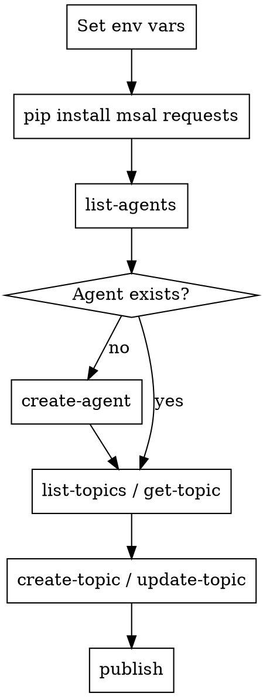

# Copilot Studio Agent Management

## Overview

Create and manage Microsoft Copilot Studio agents programmatically using the Dataverse REST API and the included Python CLI helper.

## Prerequisites

Set environment variables before running any command:

```bash
export COPILOT_STUDIO_TENANT_ID="your-azure-ad-tenant-id"
export COPILOT_STUDIO_CLIENT_ID="your-app-registration-client-id"
export COPILOT_STUDIO_CLIENT_SECRET="your-client-secret"
export COPILOT_STUDIO_ENVIRONMENT_URL="https://yourorg.crm.dynamics.com"
```

**Azure AD App Registration requires** `Dataverse user_impersonation` permission and service-principal access to the target Power Platform environment.

Install Python dependencies once:
```bash
pip install msal requests
```

## Operations Quick Reference

| Goal | Command |
|------|---------|
| List all agents | `python skills/copilot-studio/copilot-studio-client.py list-agents` |
| Get agent details | `python skills/copilot-studio/copilot-studio-client.py get-agent <bot-id>` |
| Create new agent | `python skills/copilot-studio/copilot-studio-client.py create-agent "Name"` |
| List agent topics | `python skills/copilot-studio/copilot-studio-client.py list-topics <bot-id>` |
| Get topic YAML | `python skills/copilot-studio/copilot-studio-client.py get-topic <topic-id>` |
| Create topic | `python skills/copilot-studio/copilot-studio-client.py create-topic <bot-id> "Name" -f topic.yaml` |
| Update topic | `python skills/copilot-studio/copilot-studio-client.py update-topic <topic-id> -f topic.yaml` |
| Publish agent | `python skills/copilot-studio/copilot-studio-client.py publish <bot-id>` |

## Workflow



## Topic YAML Format

Topics use Copilot Studio's adaptive dialog YAML:

```yaml
kind: AdaptiveDialog
beginDialog:
  kind: OnRecognizedIntent
  id: main
  intent:
    displayName: Greeting
    triggerQueries:
      - hello
      - hi
      - good morning
  actions:
    - kind: SendActivity
      id: sendMessage_1
      activity: Hello! How can I help you today?
    - kind: Question
      id: question_1
      prompt: What do you need help with?
      entity: string
      variable: Global.UserInput
```

**Key `kind` values:**

| kind | Purpose |
|------|---------|
| `OnRecognizedIntent` | Trigger phrases to start the topic |
| `SendActivity` | Send a message to the user |
| `Question` | Ask and capture user input |
| `ConditionGroup` | Branch conversation on conditions |
| `GotoDialog` | Jump to another topic |
| `EndDialog` | End the current topic |
| `InvokeConnectorAction` | Call an external connector/flow |

## Finding Your Environment URL

1. Go to https://admin.powerplatform.microsoft.com
2. Select your environment → **Details**
3. Copy the **Environment URL** (format: `https://yourorg.crm.dynamics.com`)

## Common Mistakes

| Mistake | Fix |
|---------|-----|
| Missing env vars | Verify all four `COPILOT_STUDIO_*` vars are exported |
| 401 Unauthorized | Token scope mismatch — ensure app has Dataverse access in target environment |
| 403 Forbidden | Add the service principal to the environment via Power Platform Admin Center |
| Schema name conflict | Use `--schema-name` to set a unique schema name on `create-agent` |
| Topic not triggering | Add at least 5 diverse trigger phrases in `triggerQueries` |
| Changes not visible | Always run `publish` after modifying topics |

## Detailed API Reference

See `api-reference.md` in this directory for raw REST endpoint details.
